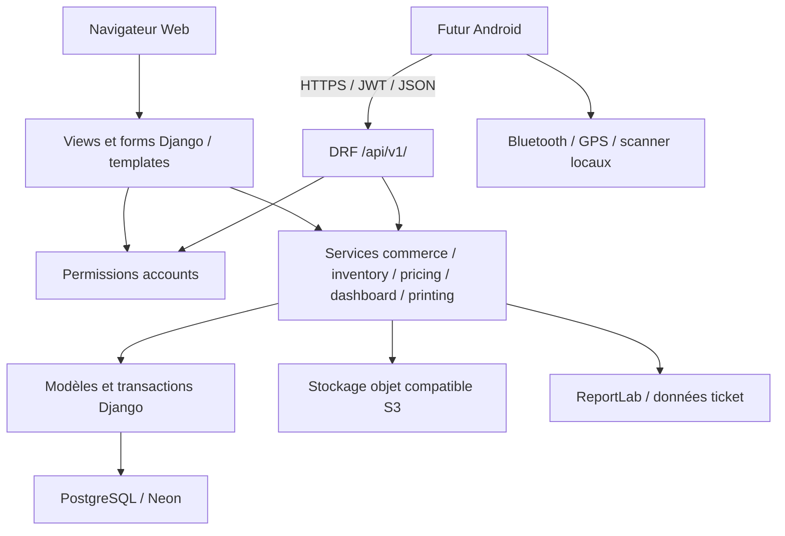

# Audit d’architecture avant Android — 13 septembre 2026

## Périmètre et état initial

Dépôt `YoucefTahir-dev/appAlimGen`, branche `main`, base `f18cee2`.
Aucun fichier suivi modifié au départ. `.pip-tools-cache/` et
`android-rpp02n-test/` sont des dossiers locaux non suivis, exclus de cet audit
et du commit. Aucun développement Android effectué.

L’inventaire ci-dessous provient du code, pas des anciens rapports de préparation.
L’application est un monolithe Django avec DRF. La production est prévue pour
PostgreSQL et le développement utilise aussi SQLite. L’état réel des paramètres
Neon, du stockage GCP et de Render n’a pas été inspecté dans leurs consoles.

## Inventaire des apps et modèles

| App | Modèles métier | Interfaces / responsabilités |
|---|---|---|
| accounts | User ; Group et Permission Django | Auth Web, profil, rôles, refus individuels, middleware des routes |
| core | CompanySettings, AuditLog | Dashboard, rapports, contrôles HTTP, sauvegardes, sécurité/uploads |
| inventory | Product, Category, Brand, Unit, ProductPackaging, ProductReferenceSequence, StockMovement, Client, Supplier | CRUD Web, tarifs, stock, import/export, localisation |
| commerce | Sale, SaleLine, Purchase, PurchaseLine, Payment, InvoiceSequence, TicketSequence | Facturation, achats, paiements, PDF et tickets |
| expenses | Expense, ExpenseCategory, ExpenseSequence | Charges, justificatifs, catégories, exports |
| printing | PrinterProfile, PrintProfile, UserPrinterPreference | Configuration, choix imprimante, payloads ; aucune connexion matérielle cloud |
| api | aucun modèle supplémentaire | serializers, ViewSets/APIViews, JWT, pagination, renderer, erreurs, OpenAPI |

Modèles système supplémentaires : sessions Django et tables blacklist/outstanding
tokens SimpleJWT. Aucune nouvelle table ou migration créée par cet audit.

Points d’entrée : `gestio_stock/urls.py`, les `urls.py` de chaque app Web et
`apps/api/urls.py`. Les pages passent par les `views.py`, `forms.py` et templates
de leur app. DRF centralise ses serializers et ViewSets dans `apps/api`.

## Services, centralisation et corrections

| Règle | Source observée | État après correction |
|---|---|---|
| Tarifs Super Gros/Gros/Détail | inventory/pricing.py | Web et API réutilisent get_sale_price ; prix manuel autorisé au-dessus du coût |
| Conversion conditionnement | commerce/services.py + SaleLine.save | Facteur et nom historisés ; quantité stock distincte de quantité vendue |
| Stock | inventory/services.py | transaction, verrouillage ordonné, mise à jour conditionnelle et journal |
| Création vente/achat | commerce/services.py | Les créations Web ont été raccordées aux mêmes services que l’API |
| TVA | commerce/services.validate_tax_rate | Limite Web 0–100 également appliquée aux services API |
| Numérotation | InvoiceSequence / TicketSequence | Deux compteurs annuels persistants, indépendants de la suppression des documents |
| Paiements | commerce/models.Payment.save | Verrou du document, montant positif, un seul document, surpaiement refusé |
| Charges | expenses/forms.py et API serializer | API corrigée pour refuser zéro et montants négatifs |
| GPS | inventory/location.py, geocoding.py | Validation partagée, coordonnées optionnelles, fournisseur appelé côté serveur |
| Dashboard | core/dashboard.py | Même calcul utilisé par Web et API |
| Impression | printing/services.py, commerce/utils.py | Données/calculs côté backend ; transport physique côté terminal |

Avant correction, `sale_create` et `purchase_create` Web calculaient/persistaient
leurs propres documents. Les services API vérifiaient la marge mais acceptaient
une TVA négative. Ce risque de divergence a motivé le refactoring ciblé.
Les mises à jour Web restent des formsets ; elles utilisent les modèles
transactionnels mais ne disposent pas d’équivalent update API. Ne pas prétendre
que toute la logique est désormais extraite dans les services.

Autres couplages : création produit Web dépend d’un formulaire dans
`create_product_from_form` ; création API dispose d’un serializer propre, les deux
passant par le même journal de stock. Les vues d’export assurent encore la mise
en page ; les modèles SaleLine/PurchaseLine portent une partie importante du métier.
Les serializers `fields='__all__'` pour partenaires/profils méritent des listes
explicites avant de futurs ajouts de champs sensibles.

## Performance

Les listes produits/stock préfetchaient déjà les conditionnements. Les tests
existants de budget de requêtes pour ventes étaient peu représentatifs car ils
ne peuplaient pas les factures. Chaque document pouvait recalculer trois fois
la somme des paiements. Les listes et historiques API préfetchaient insuffisamment
ces relations. Correction : préchargement des paiements et réutilisation de la
relation préchargée dans le calcul. Un nouveau test compare une liste de 1 puis
9 ventes payées et exige au plus une requête supplémentaire.

Réserves : les références catégories/marques/unités ne sont pas paginées ; les
alertes sont plafonnées à 100 documents par type et ne constituent pas une liste
exhaustive ; les graphiques sur de très longues périodes et les exports complets
ne sont pas des tâches asynchrones. Pas de benchmark de charge de production,
pas d’EXPLAIN sur Neon et pas de cache partagé configuré dans settings.

## Limites fonctionnelles et décisions à prendre

Les bons de chargement, affectations de stock opérateur, tournées et réservations
de stock ne sont pas implémentés dans les apps versionnées. Le commentaire de
`commerce/product_search.py` le dit explicitement. Un rôle nommé « opérateur »
ne crée pas une isolation de données : l’autorisation actuelle est par capacité
métier et les catalogues sont partagés à l’échelle de l’entreprise.

Les paiements existent dans le Web mais n’ont pas de ressource REST dédiée.
Les modifications vente/achat, retours métier, gestion des utilisateurs/rôles,
réinitialisation de mot de passe native et exports généraux ne sont pas tous
couverts par l’API. Voir ANDROID_READINESS_MATRIX.md.

Le coût historique d’une vente vient de `Product.purchase_price`, pas d’une
valorisation FIFO/CUMP. Une ligne d’achat n’actualise pas automatiquement ce
coût de référence. Le Dashboard utilise le total enregistré des ventes (TTC)
pour son gain brut. Ces choix peuvent ne pas correspondre à un bénéfice comptable
HT ; les changer serait une décision métier et n’est pas inclus dans cet audit.

## Architecture cible

Android doit consommer `/api/v1/`, conserver les tokens dans un stockage sécurisé
du terminal, envoyer les données métier et afficher les montants validés par le
serveur. GPS, scanner et Bluetooth restent locaux. Aucune connexion Android à
Neon/PostgreSQL et aucune distribution de secrets DB/GCP au terminal.

Les résultats de validation et le verdict sont dans SECURITY_AUDIT.md et
ANDROID_READINESS.md. Cet audit ne vaut pas validation physique RPP02N ni recette
de l’infrastructure de production.
