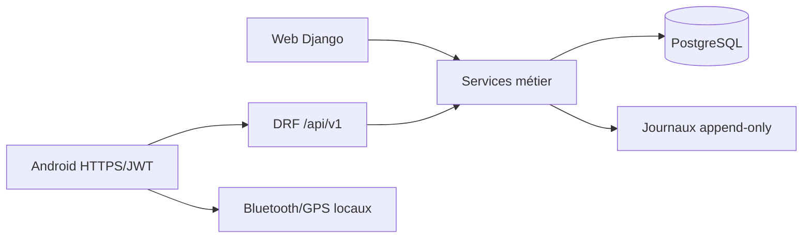

# Architecture backend prête pour Android — 13 septembre 2026

## Vue d’ensemble

Le Web Django et l’API DRF `/api/v1/` utilisent les mêmes modèles et services métier. Android reste un client HTTPS/JWT sans accès direct à PostgreSQL, GCP ou au système de fichiers du serveur.

## Modules et données ajoutés

| Domaine | Composants | Rôle |
|---|---|---|
| Auth | `User.auth_token_version`, authentification JWT versionnée | révocation globale après mot de passe |
| Chargements | `LoadingOrder`, `LoadingOrderLine`, `LoadingOrderSequence` | brouillon, validation, tournée, clôture |
| Stock opérateur | `OperatorStock`, `OperatorStockMovement` | solde isolé et journal immuable |
| Ventes | `Sale.loading_order` | rattachement automatique au chargement actif |
| Idempotence | `IdempotencyRecord` | anti-doublon des mutations réessayées |
| Paiements | `PaymentViewSet` | paiements ultérieurs/partiels pour mobile |

## Flux de stock

1. Un manager crée un bon brouillon.
2. La validation verrouille bon, produits et soldes, retire le stock du dépôt et crédite l’opérateur.
3. Toute vente de l’opérateur possédant ce bon actif débite uniquement son stock.
4. La clôture calcule le reliquat serveur, débite l’opérateur et recrédite le dépôt dans la même transaction.

Les contraintes DB complètent les validations applicatives : un seul chargement actif par opérateur, une ligne par produit, quantités positives et un solde par couple opérateur/produit.

## Déploiement

Migrations nouvelles : accounts 0005, api 0001, inventory 0015, commerce 0012. `build.sh`/`start.sh` exécutent les migrations avant Gunicorn sur Render. La CI PostgreSQL 16 vérifie migrations, configuration de production, assets, OpenAPI, tests et dépendances avant validation opérationnelle.

Les dossiers locaux non suivis `.pip-tools-cache/` et `android-rpp02n-test/` restent hors commit. Aucun projet Android n’est créé ou modifié.
